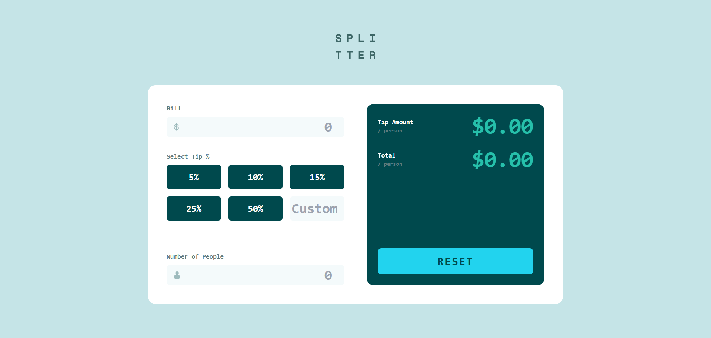

# Frontend Mentor - Tip Calculator App

Solution for the [Tip calculator app](https://www.frontendmentor.io/challenges/tip-calculator-app-ugJBaiHN-) challenge on Frontend Mentor.

## Table of contents

- [Overview](#overview)
  - [The challenge](#the-challenge)
  - [Screenshots](#screenshots)
  - [Links](#links)
- [My process](#my-process)
  - [Built with](#built-with)
  - [What I learned](#what-i-learned)
  - [Continued development](#continued-development)
- [Author](#author)

## Overview

### The challenge

Users should be able to:

- View the optimal layout for the app depending on their device's screen size
- See hover and focus states for all interactive elements on the page
- Calculate the tip amount and total cost of the bill per person based on the bill amount, tip percentage, and number of people
- Choose a predefined tip percentage (5%, 10%, 15%, 25%, 50%) or enter a custom percentage
- Reset all inputs and results to their initial state via the RESET button
- See an error message when the bill amount or number of people is 0

### Screenshots



### Links

- Solution URL: [GitHub Repository](https://github.com/Ismaellerakotoson/tip-calculator-app.git)
- Live Site URL: [Live Demo](https://ismaellerakotoson.github.io/tip-calculator-app/)

## My process

### Built with

- Semantic HTML5
- Custom CSS
- [Tailwind CSS](https://tailwindcss.com/) - utility-first CSS framework
- Flexbox
- CSS Grid
- Mobile-first workflow
- Vanilla JavaScript (DOM manipulation, event listeners)

### What I learned

This project helped me structure a centralized calculation logic around a single function (`calculateAll`), called by every relevant event listener (bill input, number of people, tip buttons, and custom tip input).

I used a shared variable (`selectedTip`) as the **single source of truth** for the tip percentage, regardless of whether it comes from a predefined button or a custom input:

```js
let selectedTip = 0;

function calculateAll() {
  const billValue = Math.max(0, Number(bill.value) || 0);
  const peopleNbr = Math.max(0, Number(people.value) || 0);
  const tipPercent = selectedTip;

  if (billValue === 0 || peopleNbr === 0) {
    tipAmount.textContent = "0.00";
    totalPerson.textContent = "0.00";
    return;
  }

  const tipAmountCalcul = (billValue * tipPercent) / peopleNbr;
  const totalCalcul = (billValue + billValue * tipPercent) / peopleNbr;

  tipAmount.textContent = tipAmountCalcul.toFixed(2);
  totalPerson.textContent = totalCalcul.toFixed(2);
}
```

I also learned how to handle visual input validation (red/green ring borders using Tailwind's `ring-2` classes) with `classList.add` / `classList.remove`, and how to dynamically disable a button using `element.disabled`.

Regarding Tailwind, I discovered that classes added **dynamically via JavaScript** must also appear **somewhere in the HTML** (even hidden), otherwise they get removed by Tailwind's purge process during the build:

```html
<div class="hidden ring-2 ring-red-500 text-red-500"></div>
```

### Continued development

- Refactor the reset logic by triggering `input` events via `dispatchEvent(new Event("input"))` instead of duplicating the validation logic.
- Add more robust handling for the custom tip percentage (min/max bounds, negative values).
- Improve accessibility (properly associated labels via `for`/`id`, ARIA attributes for error messages).

## Author

- Frontend Mentor - [@Ismaellerakotoson](https://www.frontendmentor.io/profile/Ismaellerakotoson)
- GitHub - [@Ismaellerakotoson](https://github.com/Ismaellerakotoson)